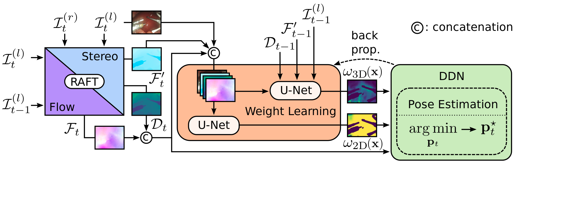

<!-- title -->
# Robust Camera Pose Estimation for Endoscopic Videos

Visual Odometry for stereo endoscopic videos with breathing and tool deformations.


[](https://github.com/aimi-lab/alley-oop/actions/workflows/tests.yaml)


## Installation

you will need Python 3.8, which can be checked with

``` $ python3 --version ```

install all requirements with

``` $ pip install -r requirements.txt ```

for optional 3D visualizations install open3D with

``` $ pip install open3d ```

checkout thirdparty code with

``` $ git submodule update --init --recursive ```


## Prepare the data

For training and (fast) inference you need to unpack and pre-process the stereo video file.
The video file needs to contains the left and right stereo images horizontally stacked. 
You need a stereo calibration file named endoscope_calibration.yaml in the same folder.
Then run the following script:
``` 
$ cd scripts
$ python preprocess_video_data.py path/to/input
```    

## Training
Train the pose estimator with
``` 
$ cd scripts
$ python train_posenet.py --log
```
you need to adapt the path to the train and validation data in the configuration file in *configuration/train.yaml*   

## Inference
You can infer the camera trajectory for a sequence with
``` 
$ cd scripts
$ python infer_trajectory.py path/to/input
```

benchmark on surgical scenarios with
``` 
$ cd scripts
$ python benchmark_scenarios.py path/to/test_set
```

benchmark on test set with
``` 
$ cd scripts
$ python benchmark_test.py path/to/test_set
```


